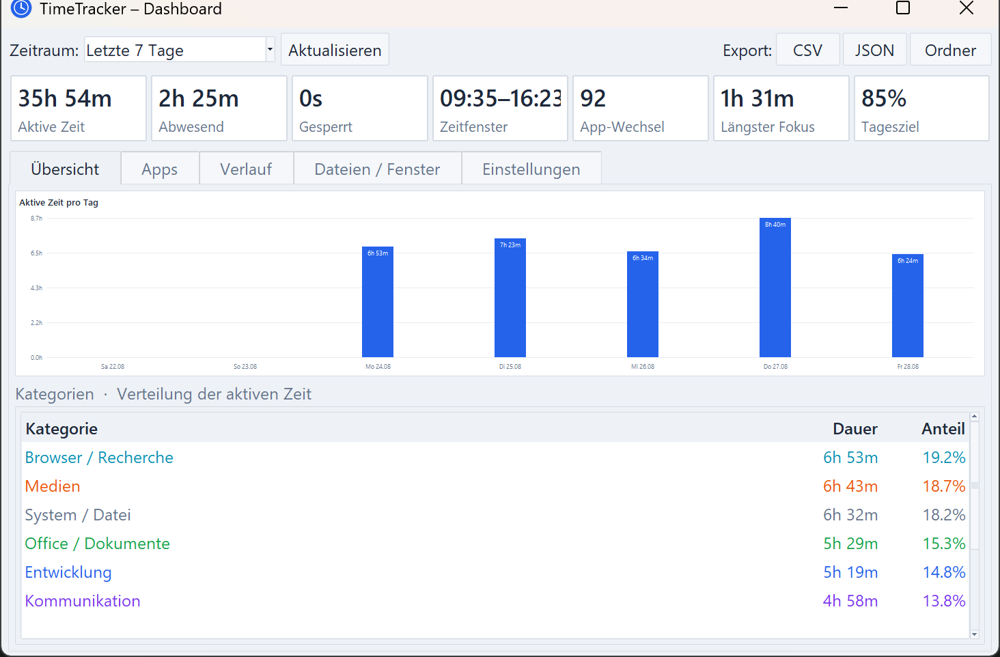
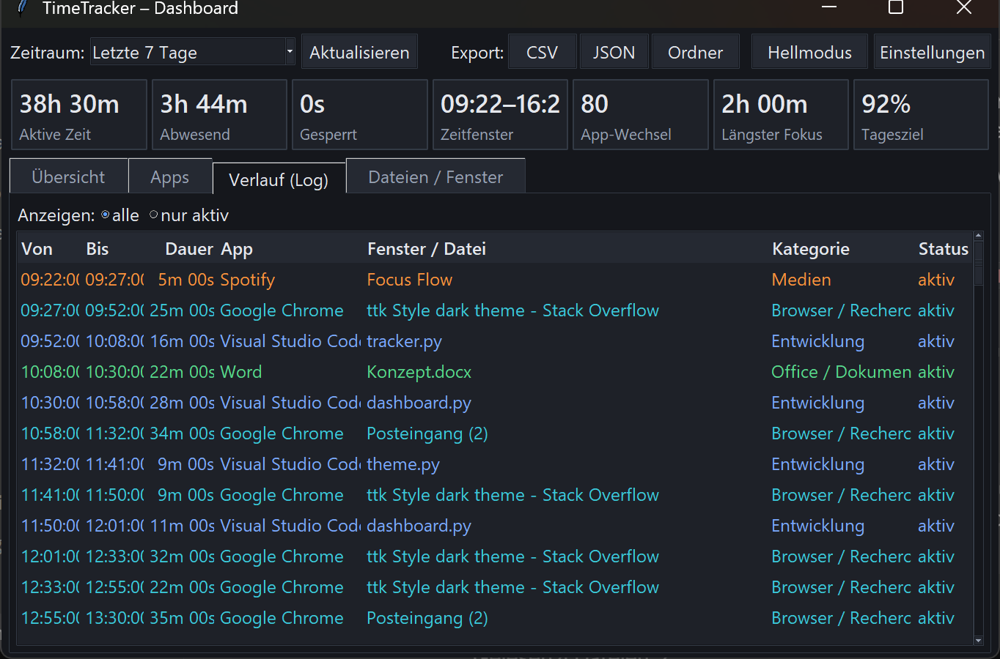
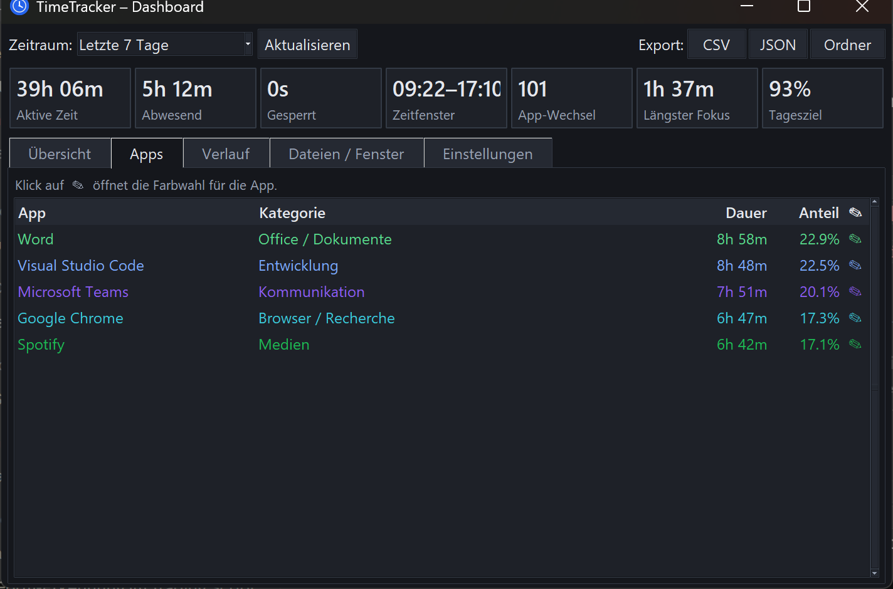
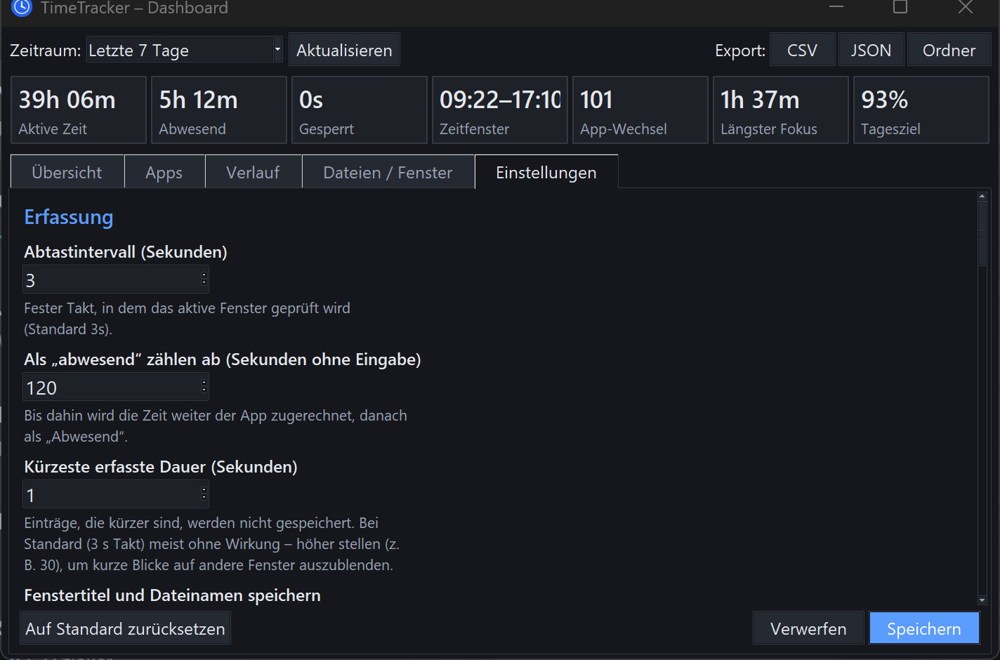

# TimeTracker

Automatische Zeiterfassung für Windows. Läuft als **Tray-Icon** im Hintergrund,
erfasst sekündlich das **aktive Fenster** (Programm **und** Fenstertitel / geöffnete
Datei) und schreibt lückenlose Zeitintervalle in eine lokale SQLite-Datenbank.
Auswertung über ein **Dashboard** (Kennzahlen, Diagramme, App-Ranglisten,
detailliertes Verlaufs-Log) oder die Kommandozeile.

Alle Daten bleiben **lokal** auf dem Rechner. Kein Netzwerk, kein Konto.









*(Die Screenshots zeigen Demo-Daten.)*

---

## Features

| Bereich | Details |
|---|---|
| **Automatisches Tracking** | Aktives Fenster per Win32-API; Programmname wird zu lesbarem Namen aufgelöst (`Code.exe` → *Visual Studio Code*). |
| **Datei-/Fensterunterscheidung** | Aus dem Fenstertitel wird die konkrete Datei / Seite herausgelöst (Browser-Tab-Titel, Word-Dokument …). |
| **Feste Taktung** | Das aktive Fenster wird alle `poll_interval_seconds` (Standard **3 s**) geprüft – nicht ereignisgesteuert. In den Einstellungen änderbar. |
| **Editor = Projekt** | VS Code, Cursor, JetBrains … werden in der Standardansicht pro **Projekt/Ordner** zusammengefasst (übersichtlicher). Der Haken **„Detailansicht (pro Datei)“** in *Verlauf* / *Dateien* zeigt jederzeit die Einzeldateien. Browser-Tabs bleiben immer einzeln. |
| **Entwicklermodus** | Optional: Spalte **Branch** in *Verlauf* und *Dateien / Fenster*. Der Branch kommt **ausschließlich aus `.git/HEAD`** – die lokalen Repos werden beim Start automatisch gefunden. Zuordnung: über den Ordnernamen (VS Code, Explorer), über den vollen Pfad im Titel (Notepad++) oder – wenn der Titel nur den Dateinamen zeigt (MetaEditor) – durch Suche der Datei in den bekannten Repos. |
| **App-Farbe & -Kategorie** | Über den *Apps*-Tab (Klick auf **✎**): eigene Farbe und Kategorie je App. Eine noch nicht vorhandene Kategorie wird beim Eintippen angelegt. Wirkt rückwirkend auf alle Auswertungen. |
| **Gesamtdauer & Log** | Pro Tag und über 7 Tage: aktive Gesamtzeit, plus chronologisches Log „Datum, von–bis, welche App, welches Fenster, welche Kategorie, welcher Status“ – neueste zuerst. |
| **Letzte 7 Tage** | Immer verfügbar (Standard-Aufbewahrung sogar 90 Tage). |
| **Leerlauf-Erkennung** | Ab 120 s ohne Eingabe wird „Abwesend“ statt der App gezählt; der Wechselzeitpunkt wird auf die letzte echte Eingabe zurückdatiert. |
| **Video / Besprechung** | Kein „Abwesend“, solange Ton läuft, eine Vollbild-Wiedergabe aktiv ist oder Kamera/Mikrofon in Benutzung sind (Teams, Zoom …). Abschaltbar. |
| **Sperrbildschirm** | Gesperrte Sitzung wird als eigener Status „Gesperrt“ erfasst. |
| **Eigene Fenster** | TimeTracker selbst (Dashboard, Einstellungen, Farb-/Kategorie-Fenster) zählt als **ein** Eintrag „TimeTracker“, nicht pro Dialog. |
| **Kategorien** | Entwicklung, Browser, Kommunikation, Office, Design, Medien, Gaming, System – frei konfigurierbar. |
| **Produktivitäts-Score** | Grobe Einordnung produktiv / neutral / ablenkend je Kategorie. |
| **Kennzahlen** | Längster ununterbrochener Fokus, Anzahl App-Wechsel, erste/letzte Aktivität, Tagesziel-Fortschritt. |
| **Diagramme** | Balken je Wochentag bzw. je Stunde des gewählten Tages. |
| **Hell / Dunkel** | In den Einstellungen (`Daten & Anzeige → Design`); „System“ folgt der Windows-Einstellung, inkl. Titelleiste. |
| **Einstellungen im Fenster** | Eigener Tab **Einstellungen** – alle Optionen aus `config.json` als Formular, kein Editieren der Datei und kein separates Fenster. |
| **Kopieren** | Tabellenzeilen per Strg+C / Rechtsklick als Tabulator-Text (Excel) in die Zwischenablage. |
| **Datenschutz** | „Private“ Programme (z. B. Passwort-Manager) und Titel-Muster (z. B. *Passwort*, *Banking*) werden ohne Details gespeichert. |
| **Export** | CSV (`;`-getrennt, Excel-tauglich) und JSON, jeweils Tag oder 7-Tage-Zeitraum. |
| **Autostart** | Optionaler Windows-Autostart (nur aktueller Benutzer, `HKCU\…\Run`). |
| **Mitternachts-Split** | Segmente über Mitternacht werden am Tageswechsel getrennt – saubere Tagesauswertung. |
| **Absturzsicher** | Offenes Segment wird bei jedem Tick fortgeschrieben; ein Absturz kostet höchstens ein Poll-Intervall. |

---

## Installation

Voraussetzung: **Windows** und **Python 3.10+** (mit `tkinter`, standardmäßig dabei).

```bash
cd C:\Programmieren\TimeTracking
pip install -r requirements.txt
```

## Starten

**Tray-App (empfohlen), ohne Konsolenfenster:**

```bash
pythonw run.pyw
```

oder Doppelklick auf `start-tray.bat`.

**Mit Konsole / zum Entwickeln:**

```bash
python -m timetracker
```

Im Tray-Menü:

* **Dashboard öffnen** – Auswertungsfenster (auch per Einfachklick aufs Icon)
* **Einstellungen …** – alle Optionen als Formular (Hell/Dunkel, Intervalle, Filter, Kategorien …)
* **Tracking pausiert** – Erfassung an/aus
* **Export der letzten 7 Tage** – CSV / JSON in den Datenordner
* **Mit Windows starten** – Autostart an/aus
* **Datenordner öffnen**
* **Beenden**

Im Dashboard (Tabs *Übersicht · Apps · Verlauf · Dateien / Fenster · Einstellungen*):

* **Einstellungen** – eigener Tab: alle `config.json`-Optionen als Formular,
  Änderungen wirken sofort (*Tray → Einstellungen …* springt ebenfalls dorthin).
* **Verlauf / Dateien**: Haken **„Detailansicht (pro Datei)“** schaltet zwischen
  Projekt-Zusammenfassung und Einzeldateien um (mit Pfad ab dem Projektordner).
* **Verlauf**: neueste Einträge oben; Klick auf einen Spaltenkopf sortiert danach
  (nochmal klicken kehrt um).
* **Apps**: Klick auf **✎** → Fenster für **Farbe & Kategorie** der App (neue Kategorie eintippen legt sie an).
* Zeilen markieren (mehrere mit Shift/Strg, alle mit **Strg+A**) und mit **Strg+C**
  oder **Rechtsklick → Kopieren** in die Zwischenablage holen – tabulatorgetrennt,
  direkt in Excel einfügbar. Im *Verlauf* wird dabei der **vollständige** Fenstertitel
  kopiert, nicht die gekürzte Anzeige.

---

## Weitergabe an andere PCs (.exe)

Auf dem **Entwicklungs-PC** einmalig bauen:

```bash
pip install pyinstaller
python build.py
```

(oder Doppelklick auf `build.bat`). Ergebnis: **`dist\TimeTracker.exe`** – eine einzelne
Datei (~17 MB), die **kein Python** auf dem Zielrechner braucht.

Auf dem **Ziel-PC**:

1. `TimeTracker.exe` irgendwohin kopieren (z. B. `C:\Tools\TimeTracker\`) und doppelklicken.
2. Optional im Tray-Menü **„Mit Windows starten"** aktivieren → startet künftig automatisch.

Details:

* Beim ersten Start meldet sich ggf. **Windows SmartScreen** („Weitere Informationen“ →
  „Trotzdem ausführen“), weil die .exe nicht signiert ist. Einzelne Virenscanner schlagen
  bei PyInstaller-`--onefile`-Dateien Fehlalarm – dann `python build.py --onedir` bauen
  (ergibt einen Ordner statt einer Datei, startet schneller, weniger Fehlalarme) und den
  **ganzen Ordner** kopieren.
* Nur **eine Instanz** läuft gleichzeitig (Named Mutex) – Doppelklick bei laufender App
  zeigt nur einen Hinweis.
* Jeder PC führt seine **eigene** Datenbank unter `%LOCALAPPDATA%\TimeTracker\`.
* Voraussetzung Ziel-PC: 64-bit Windows 10/11. Keine weiteren Abhängigkeiten.

Alternative ohne .exe (wenn auf allen PCs Python vorhanden ist): Projektordner kopieren,
`pip install -r requirements.txt`, dann `pythonw run.pyw`.

---

## Kommandozeile

```bash
python -m timetracker                       # Tray-App (Standard)
python -m timetracker dashboard             # nur das Dashboard
python -m timetracker status                # Kurzüberblick "heute"
python -m timetracker report                # Klartext-Bericht (7 Tage)
python -m timetracker report --day 2026-08-27
python -m timetracker report -d 3           # letzte 3 Tage
python -m timetracker export --format csv --out bericht.csv
python -m timetracker export --format json --day 2026-08-27
python -m timetracker autostart --enable    # / --disable / --status
```

---

## Datenablage

Alles unter `%LOCALAPPDATA%\TimeTracker\`:

| Datei | Inhalt |
|---|---|
| `activity.db` | SQLite-Datenbank mit allen Segmenten |
| `config.json` | Konfiguration (siehe unten) |
| `timetracker.log` | Rotierendes Logfile |
| `exports\` | Exportierte CSV-/JSON-Dateien |

### `config.json` – wichtigste Optionen

Am bequemsten über den **Einstellungen**-Tab im Dashboard (oder **Tray → Einstellungen …**);
die Datei kann aber auch direkt bearbeitet werden.

| Schlüssel | Standard | Bedeutung |
|---|---|---|
| `poll_interval_seconds` | `3` | Fester Prüf-Takt fürs aktive Fenster (nicht ereignisgesteuert) |
| `idle_threshold_seconds` | `120` | Ab wann „Abwesend“ |
| `keep_active_on_media` | `true` | Kein „Abwesend“ bei Video (Ton) / Vollbild / Besprechung |
| `retention_days` | `90` | Aufbewahrung (min. 7) |
| `track_titles` | `true` | Fenstertitel/Dateien speichern |
| `collapse_editor_projects` | `true` | Merkt sich den „Detailansicht“-Haken (aus = pro Projekt) |
| `editor_processes` | `[]` | zusätzliche Editoren/IDEs für die Projekt-Gruppierung |
| `developer_mode` | `false` | Branch-Spalte in Verlauf / Dateien einblenden (Repos werden automatisch gefunden) |
| `project_roots` | `[]` | *optional* – zusätzliche Ordner für den Repo-Scan (normalerweise nicht nötig) |
| `app_colors` | `{}` | Eigene Farbe je App: `{"Visual Studio Code": "#2563eb"}` (Apps-Tab → ✎) |
| `app_categories` | `{}` | Eigene Kategorie je App: `{"Visual Studio Code": "Meine Firma"}` (Apps-Tab → ✎) |
| `idle_goal_hours` | `6.0` | Tagesziel „aktive Zeit“ |
| `theme` | `"system"` | `"system"` \| `"light"` \| `"dark"` |
| `private_processes` | Passwort-Manager | Keine Details speichern |
| `private_title_patterns` | `passwort`, `banking`, … | Titel-Regex, keine Details |
| `ignore_processes` | Startmenü, Suche, … | Transiente Shell-Fenster – unterbrechen den laufenden Eintrag nicht |
| `ignore_title_patterns` | `Überlauffenster der Taskleiste`, `Task-Umschalten` | dito, per Titel-Regex |
| `app_names` | `{}` | Eigene Anzeigenamen: `{"foo.exe": "Foo"}` |
| `categories` | *(interne Defaults)* | Eigene Kategorie-Regeln (ersetzt Defaults, wenn gesetzt) |
| `productivity` | *(interne Defaults)* | `{"Kategorie": 1 | 0 | -1}` |

Beispiel für eine eigene Kategorie-Regel:

```json
"categories": [
  {"category": "Meine Firma", "processes": ["sap.exe"], "title_patterns": ["JIRA", "Confluence"]}
]
```

---

## Datenmodell

Tabelle `segments` – ein Eintrag pro zusammenhängendem Zeitraum mit gleichem
Fenster(titel) **und** gleichem Status. Es wird **pro Datei/Tab** gespeichert;
das Zusammenfassen zu „Projekt“ passiert erst bei der Anzeige.

```
id, start_utc, end_utc, day, state (active|idle|locked),
process, exe_path, app, title, document, category, branch
```

---

## Architektur

```
timetracker/
  winapi.py           ctypes-Wrapper: aktives Fenster, Leerlauf, Sperre
  classify.py         Prozess → Anzeigename, Titel → Datei/Projekt/Branch, Kategorie, Filter
  gitinfo.py          findet lokale Git-Repos, liest .git/HEAD (Branch-Anzeige)
  presence.py         Anwesenheit trotz fehlender Eingabe (Ton / Vollbild / Kamera-Mikro)
  database.py         SQLite (WAL, eine Verbindung pro Thread, Spalten-Migration)
  tracker.py          Hintergrund-Thread: pollt & schreibt Segmente (pro Datei)
  reporting.py        Aggregation, Verlauf, Projekt-Collapse, CSV/JSON-Export
  dashboard.py        Tkinter-Fenster (Kennzahlen, Diagramme, Tabellen, Copy)
  appstyle.py         Dialog "Farbe & Kategorie" je App (theme-bewusst)
  theme.py            Hell-/Dunkel-Paletten + ttk-Styling + Titelleisten-Farbe
  settings.py         Einstellungen-Panel (Formular-Tab für alle config.json-Optionen)
  tray.py             pystray-Icon + Menü (+ .ico-Erzeugung für den Build)
  autostart.py        HKCU\...\Run  (erkennt gebündelte .exe)
  single_instance.py  Named Mutex – nur eine Instanz gleichzeitig
  app.py              verdrahtet alles (Tray im Hauptthread, Dashboard im Worker-Thread)
  __main__.py         CLI
run.pyw               fensterloser Start (Doppelklick / Autostart / PyInstaller-Einstieg)
build.py / build.bat  baut dist\TimeTracker.exe (PyInstaller)
```

---

## Hinweise & Grenzen

* Nur **Windows** (nutzt `user32`/`kernel32` und `winreg`).
* Die „Datei-Erkennung“ basiert auf dem Fenstertitel – bei Programmen ohne
  aussagekräftigen Titel bleibt nur der App-Name.
* Die Leerlauf-Erkennung ist systemweit (`GetLastInputInfo`). Damit lange Videos und
  Besprechungen nicht als „Abwesend“ zählen, gilt der Nutzer auch dann als anwesend, wenn
  Ton läuft (Core-Audio-Pegel), eine Vollbild-Wiedergabe aktiv ist oder Kamera/Mikrofon
  benutzt werden (`keep_active_on_media`, Standard an). Nachteil: laufende Musik ohne
  Anwesenheit zählt dann ebenfalls als aktiv.
* `pythonw.exe` starten heißt: kein Fenster. Beenden nur über das Tray-Menü.
